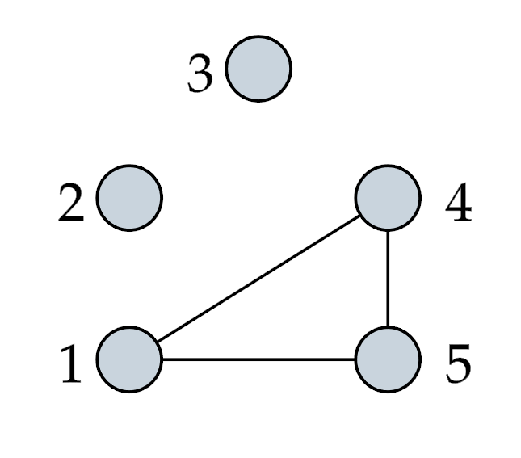
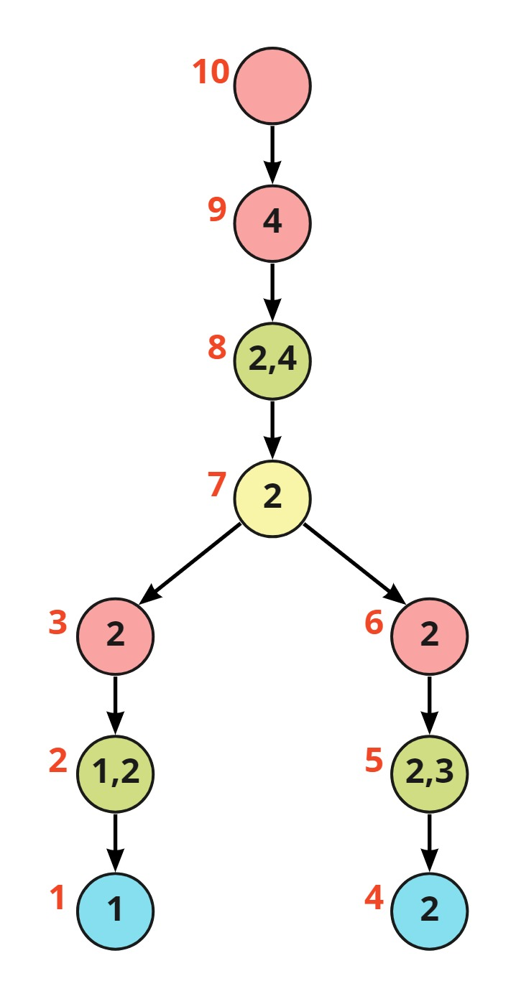

# Counting homomorphisms in Rust

[Díaz, Serna, and Thilikos](https://www.sciencedirect.com/science/article/pii/S0304397502000178) (2002) introduced a dynamic programming algorithm to count the number of [graph homomorphisms](https://en.wikipedia.org/wiki/Graph_homomorphism) from a (small) pattern graph to a (large) host graph.
The algorithm runs in time O(n^{t+1}), where n is the number of vertices of the host graph and t is the [treewidth](https://en.wikipedia.org/wiki/Treewidth) of the pattern graph.

In this repository, we provide a clean implementation of this dynamic programming algorithm in Rust, a test suite, and running time experiments.
Moreover, we engineer an extension of this algorithm that enables us to compute many homomorphisms in parallel: In particular, given a tree decomposition T of a k-vertex graph, our enhanced program can simultaneously count homomorphisms from _all_ k-vertex pattern graphs for which T is a valid tree decomposition.

## Input format for graphs

We use a simplified version of the [METIS](http://glaros.dtc.umn.edu/gkhome/metis/metis/overview) format to represent graphs.
Here is an example of the graph format:

```
% A graph with 5 vertices and 3 edges
5 3
% vertex 1 has neighbors 4 and 5:
4 5
% vertex 2 has no neighbors:


% vertex 4 has neighbors 1 and 5:
1 5
1 4
```

The example represents the following graph.



More precisely, the input format has the following parts:

1. Comments begin with `%`
2. The first non-comment line contains the number of vertices and the number of edges
3. The remaining lines contain the neighbors of each vertex: the i-th non-comment line contains the neighbors of the i-th vertex

Additionally, we also support the graph format used for the [PACE challenge](https://github.com/PACE-challenge/Treewidth)

## Input format nice tree decompositions

To store nice tree decompositions, we use a custom format with the file extension `.ntd`.
The format has been inspired by [this format for tree decompositions](https://github.com/PACE-challenge/Treewidth#output-format).
Here is an example:

```
s 10 2 4
n 1 l 1
n 2 i 1 2
n 3 f 2
n 4 l 2
n 5 i 2 3
n 6 f 2
n 7 j 2
n 8 i 2 4
n 9 f 4
n 10 f
a 2 1
a 3 2
a 7 3
a 5 4
a 6 5
a 7 6
a 8 7
a 9 8
a 10 9
```

The example represents the following nice tree decomposition:



The `.ntd` files consist of three parts:

1. `s`-line: This line describes the main parameters of the nice tree decomposition: number of nodes, width + 1, and number of vertices of the original graph.
2. `n`-lines: These line describe the nodes of the tree. The first argument is the ID of the node, the second argument describes the node type:
   1. `l` : Leaf Node
   2. `i` : Introduce Node
   3. `f` : Forget Node
   4. `j` : Join Node
3. `a`-lines: These lines describe the edges of the tree. For example, `a 7 3` means there is an edge from node `7` to node `3`, that is, that node `3` is the child of node `7`.

Note that the indices in the file run from 1 to N while the internal representation consists of indices 0 to N-1.

## How to run the experiments

1. Clone the repository. Test data is already included.
2. Run the command `cargo test` in the main project folder to run unit tests.
3. Run the command `cargo run --release` in the main project folder to start the experiments.
4. To visualize the results, use the `evaluation.ipynb` file, which can be executed with jupyter-lab and immediately shows the results, provided that the `seaborn` python package is installed.
